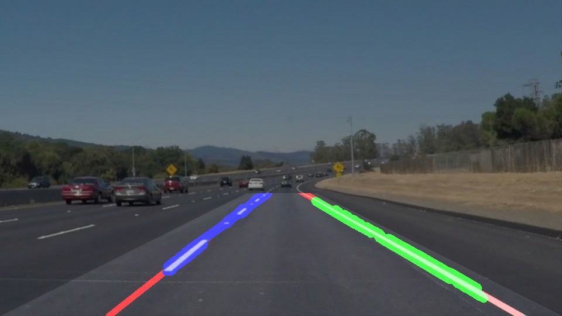
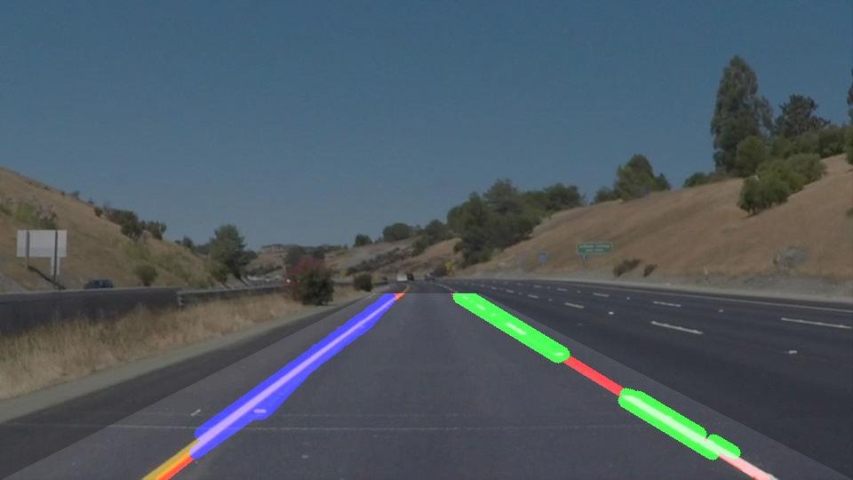

# **Finding Lane Lines on the Road**

---

**Finding Lane Lines on the Road**

The goals / steps of this project are the following:
* Make a pipeline that finds lane lines on the road
* Reflect on your work in a written report

---

### Reflection

### 1. Describe your pipeline. As part of the description, explain how you modified the draw_lines()
function.

The following base pipeline has been implemented (function `process_image`):

 1. **Grayscale conversion:** in order to enhance the detection of the farthest broken lines, the
    grayscale conversion has been carried out by applying a maximum filter along the two spatial
    dimensions (rows, columns) and a max pooling along the third dimension (channels).
 2. **Gaussian blurring:** a kernel size of 7 pixels has been chosen.
 3. **Canny:** the thresholds applied have been 60 (low) and 180 (high).
 4. **Masking:** a trapezoid having the lower image side as major basis and a 120 pixels wide minor
    basis put 60 pixels below the central row has been exploited to define the Region-Of-Interest.
    An additional cut of the lowest 30 rows has been applied because edges in that position have
    very high leverage in the line fitting (see below) causing more problems than beneficts.
 5. **Hough:** as suggested, the Probabilistic Hough Transform has been exploited in order to detect
    the lines. The applied parameters have been: Threshold=10, MinimumLength=10, MaximumGap=50,
    rho=13, theta=11°.
 6. **Line fitting** (a.k.a. draw lines) **:** the output of `cv2.HoughLinesP` has been separated in
    three groups:
     \- Left (lines with negative slope)
     \- Right (lines with positive slope)
     \- Horizontal (lines with absolute slope under 30°).
    The horizontal lines have been discarded because they are likely to be false alarms. Moreover,
    Lines crossing the ROI symmetry axis have been removed. Horizontal lines have been discarded
    too, because they are likely to be false alarms. For each one of the other two groups, a
    LSE line fitting on the points belonging to the corresponding lines has been performed. The
    possibility to increase the polynomial degree has been kept but not used, because higher order
    polynomials are more sensitive to missed broken lines.
 7. **Augmentated reality:** the detected lines are drawn over the input image.

This demonstrated to work quite well without other special customizations on:

 - static images
 - first clip (solid white right)
 - second clip (solid yellow left)

Some examples (red=detected line, blue=left edges, gree=right edges, image outside ROI grayed):

However, to make it run acceptably on the third clip (challenge) three actions have been performed:

 - Retain only those edges corresponding to bright pixels (yellow lines are bright too).
 - Change Low and High Canny Thresholds (new values: 80,120) because the asphalt is much more
   irregular.
 - Lower and enlarge the ROI (minor basis = 160, offset from center row = 70) to avoid the road
   sides to enter the ROI due to the important bend.

In order to not change other parameters only due to the different frame size (1280x720 vs 960x540),
the clip has been resampled before the pipeline.

### 2. Identify potential shortcomings with your current pipeline

Detected lines flicker. This is mainly due to the broken lines that keep entering and exiting the
ROI. But even the unbroken line slightly flicker. This is connected to the second issue.
The probabilistic Hough transform has too many parameters and it is hard to understand the effect of
small changes in them. For example, one would expect that by increasing rho it would be less
sensitive to imperfections in the edge detection step, and hence find more lines. But this is not
always the case. Moreover, the detected lines are often not along edges but across parallel edges.
In these cases the pipeline still works thanks to the line fitting step, but all in all it does not
give the sensation of a very robust pipeline. This has become quite evidente in the challenge: more
irregular asphalt and more significant bends required to change some parameters, and the new set
does not work equally well with the previous images and videos.

### 3. Suggest possible improvements to your pipeline

Flickering can be easily resolved by time averaging. It has not be done because it looked
out-of-scope. But I am not sure it could help with robustness in general. Maybe finding the strips
as a whole instead of through its edges could help. Another possibility is to take into account the
prospective effect, which introduces spatially variant conditions (e.g. the same kernel size in
pixels leads to different ground sizes in the lower and medium part of the image). Last but not
least, a more meaningful set of parameters that does not require a recalibration on image resizing
would be of a great benefit.
As a side note, the polynomial fitting looked very inviting because it could be easily generalized
to non-straight lines. Tests in this sense showed that polynomials of degree 2 cannot fit well
broken lines when the "hole" lays in the lower part, sometimes leading even to wrong curvature sign.
